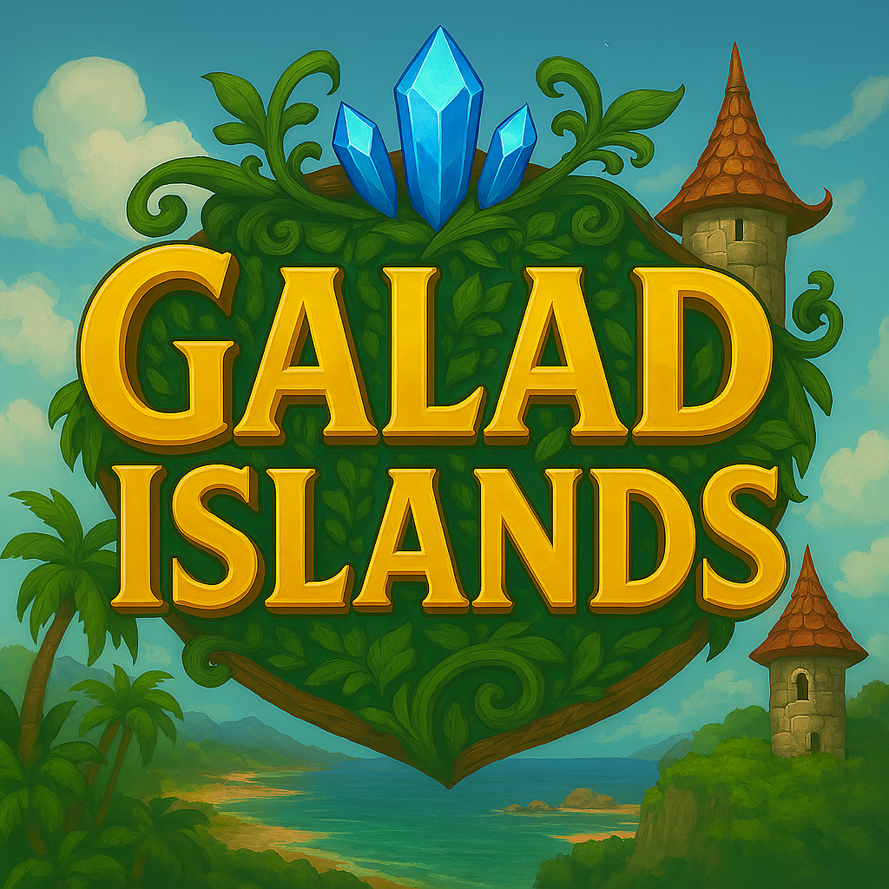

---
i18n:
  en: "Home"
  fr: "Accueil"
---

# Galad Islands - Documentation

Welcome to the complete **Galad Islands** documentation! 🏝️

## 🎮 What is Galad Islands?

Galad Islands is a real-time strategy game that immerses you in a war between two factions in a floating archipelago. Manage your resources, build diverse units, and lead your armies to victory in epic aerial battles!

## 📚 Documentation Navigation

This documentation is organized into two main sections:

### 📖 User Documentation

*For players who want to master the game*

#### 🏁 Basics

- **[Introduction](user/basics/introduction.md)** - Game presentation
- **[Getting Started Guide](user/basics/getting-started.md)** - Installation and first steps
- **[Installation](user/basics/installation.md)** - Detailed installation guide

#### 🎮 Gameplay

- **[Controls](user/gameplay/controls.md)** - Game mechanics and controls
- **[Gameplay](user/gameplay/gameplay.md)** - General game principles
- **[Action Bar](user/gameplay/action-bar.md)** - Interface and shortcuts

#### ⚔️ Units

- **[Units](user/units/units.md)** - Guide to units and their abilities

#### 🏗️ Economy

- **[Buildings](user/economy/buildings.md)** - Constructions and defenses
- **[Shop](user/economy/shop.md)** - Purchase and economy system

#### 🛠️ Tools

- **[Galad Configuration Tool](user/tools/galad-config-tool.md)** - Game configuration

#### ❓ Help

- **[FAQ](user/help/faq.md)** - Frequently asked questions and troubleshooting
- **[Credits](user/help/credits.md)** - Team and acknowledgments

### 🛠️ Technical Documentation

#### For developers and contributors

##### Development

- **[Overview](dev/01-introduction/overview.md)** - General project architecture
- **[API](dev/02-systeme/api/game-engine.md)** - Programming interface documentation
- **[Modules](dev/02-systeme/modules/processors.md)** - Internal code structure
- **[Contribution](dev/07-annexes/contributing.md)** - Guide for contributing to the project

#### System and deployment

- **[Critical system parameters](dev/05-exploitation/systeme.md)** - Configuration and performance optimization
- **[Hardware requirements](dev/03-installation/requirements.md)** - Required hardware/software and dependencies
- **[System operations](dev/05-exploitation/operations.md)** - Monitoring, backup, security and maintenance

## ✨ Main Features

### 🚁 Diverse Units

**Allies:**

- **Zasper**: Light and fast scout
- **Barhamus**: Medium robust marauder
- **Draupnir**: Heavy destructive leviathan
- **Druid**: Healer and magical support
- **Architect**: Defense builder

**Enemies:**

- **Valkar**: Fast and aggressive interceptor
- **Goliath**: Heavily armored with high firepower
- **Spectre**: Stealth unit specialized in sabotage
- **Necroprêtre**: Support that weakens your troops
- **Bastion**: Mobile defensive platform

### 🏰 Construction and Defense

- Automatic defense towers
- Healing towers for your allies
- Strategic construction system

### 💰 Economic System

- Collect gold naturally or from chests on the map
- Buy units in the shop
- Upgrade your abilities

### 🎯 Tactical Gameplay

- Intuitive keyboard controls
- Free camera with zoom
- Clear and ergonomic interface

## 🚀 Quick Start

1. **Launch the game** by running `galad-islands.exe` or `galad-islands`
2. **Learn the controls** with the arrow keys
3. **Select your units** with the number keys
4. **Explore the map** and collect gold
5. **Buy new units** with the `B` key
6. **Dominate the archipelago**!

!!! tip "Starting tip"
    Start by exploring the map to find flying chests or gold on the islands and map out areas before engaging in combat!

## 📚 Navigation in this guide

- **[Getting Started Guide](user/basics/getting-started.md)**: First steps
- **[Installation and Configuration](user/basics/installation.md)**: How to install and configure the game
- **[Controls](user/gameplay/controls.md)**: All game commands
- **[Units](user/units/units.md)**: Detailed guide for each unit type

## 🎵 Atmosphere

Galad Islands immerses you in a fantastic universe with:

- Epic and immersive music
- Detailed pixel art graphics
- Authentic sound effects
- Unique aerial adventure atmosphere

---

*Ready to conquer the skies of Galad Islands? Good luck, commander!* ⚓️✈️
