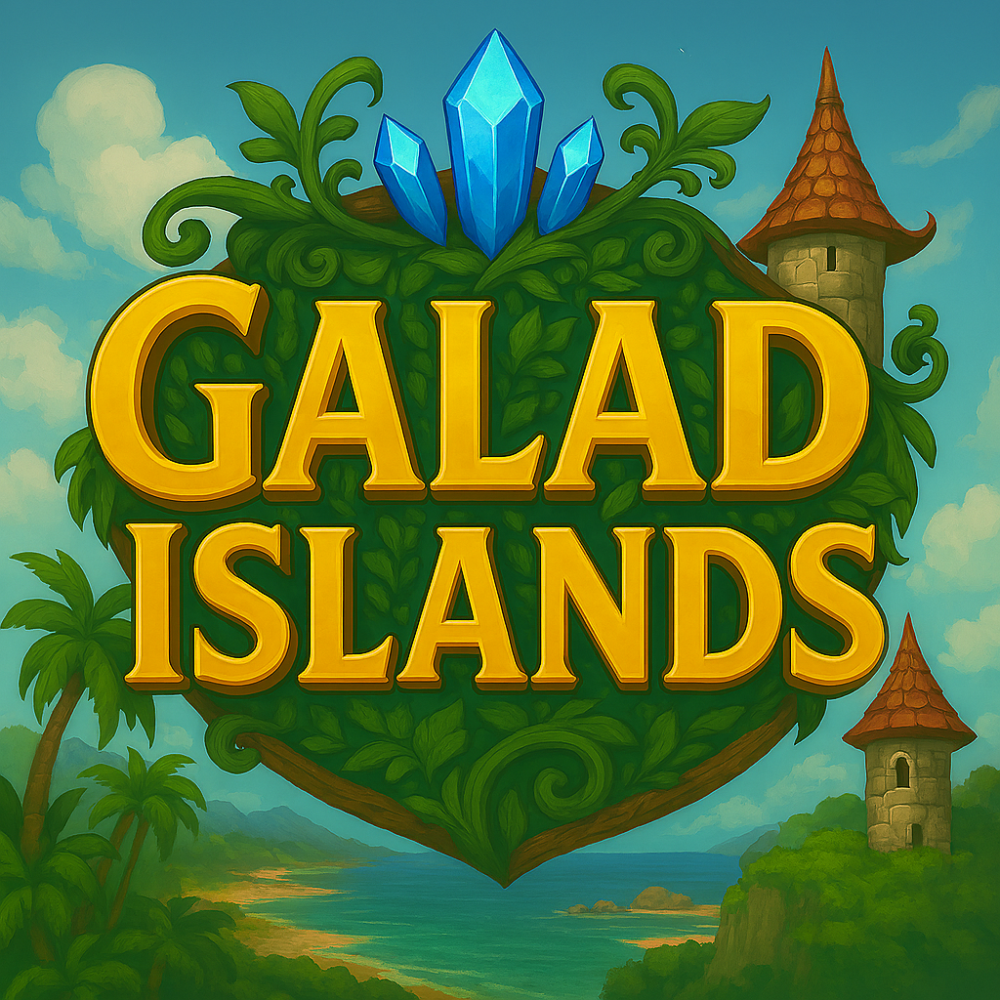

# Galad Islands - Documentation

Bienvenue dans la documentation complète de **Galad Islands** ! 🏝️

## 🎮 Qu'est-ce que Galad Islands ?

Galad Islands est un jeu de stratégie en temps réel qui vous plonge dans une guerre entre deux factions dans un archipel aérien. Gérez vos ressources, construisez des unités variées et menez vos armées à la victoire dans des batailles aériennes épiques !

## 📚 Navigation de la documentation

Cette documentation est organisée en deux sections principales :

### 📖 Documentation Utilisateur
*Pour les joueurs qui veulent maîtriser le jeu*

- **[Guide de démarrage](user/getting-started.md)** - Installation et premiers pas
- **[Gameplay](user/controls.md)** - Mécaniques de jeu, unités, bâtiments
- **[Stratégie](user/strategy.md)** - Tactiques avancées et conseils
- **[FAQ](user/faq.md)** - Questions fréquentes et dépannage

### 🛠️ Documentation Technique  
*Pour les développeurs et contributeurs*

- **[Vue d'ensemble](dev/overview.md)** - Architecture générale du projet
- **[API](dev/api/game-engine.md)** - Documentation des interfaces de programmation
- **[Modules](dev/modules/processors.md)** - Structure interne du code
- **[Contribution](dev/contributing.md)** - Guide pour contribuer au projet

## ✨ Caractéristiques principales

### 🚁 Unités diversifiées
**Alliés :**
- **Zasper** : Scout léger et rapide
- **Barhamus** : Maraudeur moyen robuste  
- **Draupnir** : Léviathan lourd destructeur
- **Druid** : Soigneur et support magique
- **Architect** : Constructeur de défenses

**Ennemis :**
- **Valkar** : Intercepteur rapide et agressif
- **Goliath** : Blindé lourd à grande puissance de feu
- **Spectre** : Unité furtive spécialisée dans le sabotage
- **Nécroprêtre** : Soutien qui affaiblit vos troupes
- **Bastion** : Plateforme défensive mobile

### 🏰 Construction et défense
- Tours de défense automatiques
- Tours de soin pour vos alliés
- Système de construction stratégique

### 💰 Système économique
- Collectez de l'or naturellement ou dans les coffres sur la carte
- Achetez des unités dans la boutique
- Améliorez vos capacités

### 🎯 Gameplay tactique
- Contrôles intuitifs au clavier
- Caméra libre avec zoom
- Interface claire et ergonomique

## 🚀 Démarrage rapide

1. **Lancez le jeu** en exécutant `main.py`
2. **Apprenez les contrôles** avec les flèches directionnelles
3. **Sélectionnez vos unités** avec les touches numériques
4. **Explorez la carte** et collectez de l'or
5. **Achetez de nouvelles unités** avec la touche `B`
6. **Dominez l'archipel** !

!!! tip "Conseil de départ"
    Commencez par explorer la carte pour trouver les coffres et cartographier les zones avant d'engager le combat !

## 📚 Navigation de ce guide

- **[Guide de démarrage](getting-started.md)** : Premiers pas
- **[Installation et Configuration](installation.md)** : Comment installer et configurer le jeu
- **[Contrôles](controls.md)** : Toutes les commandes du jeu
- **[Unités](units.md)** : Guide détaillé de chaque type d'unité
- **[Stratégie](strategy.md)** : Conseils tactiques avancés

## 🎵 Ambiance

Galad Islands vous plonge dans un univers steampunk avec :
- Musique épique et immersive
- Graphismes détaillés en pixel art
- Effets sonores authentiques
- Atmosphère unique d'aventure aérienne

---

*Prêt à conquérir les cieux de Galad Islands ? Bonne chance, commandant !* ⚓️✈️
