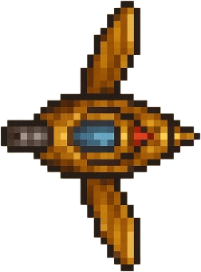
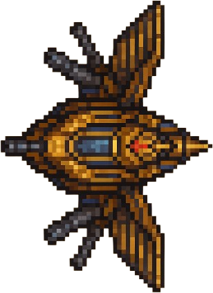
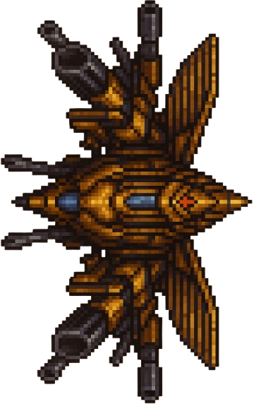
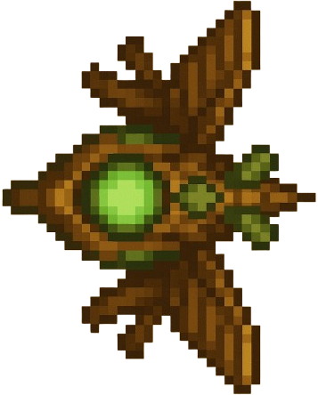
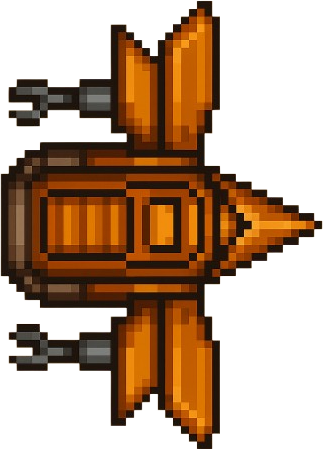

# 🪖 Guide des Unités

Bienvenue dans le guide complet des unités de **Galad Islands**. Retrouvez ici toutes les informations sur les unités alliées et ennemies, leurs capacités et conseils tactiques.

---

!!!tip warning
    **Note à l'attention des rédacteurs** : Il faudrait relire cette page. J'ai peur qu'il y ait des erreurs.

## 🟦 Unités alliées

### Vue d'ensemble

Le camp des joueurs propose **5 unités principales**, chacune avec ses spécificités tactiques :

| Unité         | Type         | Rôle             | Coût   | Vie  | Attaque |
|--------------|--------------|------------------|--------|------|---------|
| **Zasper**   | Scout        | Reconnaissance   | 50 or  | 100  | 25      |
| **Barhamus** | Maraudeur    | Combat moyen     | 100 or | 200  | 50      |
| **Draupnir** | Léviathan    | Unité lourde     | 300 or | 500  | 150     |
| **Druid**    | Support      | Soigneur         | 150 or | 150  | 0       |
| **Architect**| Constructeur | Défense          | 200 or | 180  | 30      |

---

### ⚡ Zasper — Scout léger

#### Caractéristiques principales

- **Type** : Unité de reconnaissance
- **Vitesse** : ⭐⭐⭐⭐⭐ (Très rapide)
- **Résistance** : ⭐⭐ (Fragile)
- **Attaque** : ⭐⭐ (Légère)
- **Coût** : 50 pièces d'or

#### Capacité spéciale : Vision étendue (`R`)

- **Effet** : Révèle une large zone autour de l'unité pendant 10 secondes
- **Cooldown** : 15 secondes
- **Portée** : 200% de la vision normale

#### Utilisation tactique

!!! tip "Stratégie Zasper"
    **Utilisez le Zasper pour :**
    
    - Éclaireur en début de partie
    - Exploration rapide de la carte
    - Harcèlement des unités ennemies isolées
    - Collecte rapide de ressources
    - Diversion et esquive

!!! warning "Attention"
    Le Zasper est très fragile ! Évitez les combats frontaux contre des unités lourdes.

### 🛡️ Barhamus — Maraudeur moyen

#### Caractéristiques principales

- **Type** : Unité de combat polyvalente
- **Vitesse** : ⭐⭐⭐ (Normale)
- **Résistance** : ⭐⭐⭐⭐ (Robuste)
- **Attaque** : ⭐⭐⭐ (Équilibrée)
- **Coût** : 100 pièces d'or

#### Capacité spéciale : Charge (`R`)

- **Effet** : Attaque rapide avec +50% de dégâts pendant 5 secondes
- **Cooldown** : 20 secondes
- **Bonus** : Vitesse de déplacement temporairement accrue

#### Utilisation tactique

!!! tip "Stratégie Barhamus"
    **Le Barhamus excelle pour :**
    
    - Combat de ligne de front
    - Défense de positions stratégiques
    - Escorte d'unités fragiles (Druid, Architect)
    - Attaques coordonnées en groupe
    - Résistance aux attaques ennemies

### 🐉 Draupnir — Léviathan lourd

#### Caractéristiques principales

- **Type** : Unité de destruction massive
- **Vitesse** : ⭐ (Très lent)
- **Résistance** : ⭐⭐⭐⭐⭐ (Blindé)
- **Attaque** : ⭐⭐⭐⭐⭐ (Dévastatrice)
- **Coût** : 300 pièces d'or

#### Capacité spéciale : Bombardement (`R`)

- **Effet** : Attaque de zone infligeant des dégâts massifs
- **Cooldown** : 30 secondes
- **Zone d'effet** : 3x3 cases
- **Dégâts** : 200% des dégâts normaux

#### Utilisation tactique

!!! tip "Stratégie Draupnir"
    **Le Draupnir est parfait pour :**
    
    - Détruire les défenses ennemies
    - Éliminer les groupes d'unités
    - Contrôler les points stratégiques
    - Assauts finaux sur les bases ennemies
    - Tank principal dans les gros combats

!!! warning "Gestion du Draupnir"
    - Très coûteux à remplacer
    - Vulnérable aux attaques coordonnées
    - Nécessite une escorte de soutien

### 🌿 Druid — Soigneur et support

#### Caractéristiques principales

- **Type** : Unité de support médical
- **Vitesse** : ⭐⭐ (Lent)
- **Résistance** : ⭐⭐⭐ (Moyenne)
- **Attaque** : ⭐ (Aucune attaque directe)
- **Coût** : 150 pièces d'or

#### Capacité spéciale : Soin de groupe (`R`)

- **Effet** : Soigne toutes les unités alliées dans un rayon de 100 pixels
- **Cooldown** : 12 secondes
- **Soin** : 50 points de vie par unité
- **Soin continu** : 5 PV/seconde en combat

#### Utilisation tactique

!!! tip "Stratégie Druid"
    **Le Druid est essentiel pour :**
    
    - Maintenir vos unités en vie
    - Prolonger les combats difficiles
    - Soutenir les attaques prolongées
    - Économiser l'or en évitant les remplacements
    - Support arrière dans les formations

!!! danger "Protection du Druid"
    **Le Druid est une cible prioritaire !**
    
    - Gardez-le toujours en arrière
    - Entourez-le d'unités de combat
    - Utilisez le terrain à votre avantage

### 🏗️ Architect — Constructeur de défenses

#### Caractéristiques principales

- **Type** : Unité de construction
- **Vitesse** : ⭐⭐ (Lent)
- **Résistance** : ⭐⭐⭐ (Moyenne)
- **Attaque** : ⭐⭐ (Attaque de construction)
- **Coût** : 200 pièces d'or

#### Capacité spéciale : Construction rapide (`R`)

- **Effet** : Construit instantanément une tour de défense
- **Cooldown** : 45 secondes
- **Types** : Tour d'attaque ou tour de soin
- **Coût matériel** : 50 or supplémentaires

#### Constructions disponibles

*Tour de Défense*

- **Coût** : 50 or (+ coût Architect)
- **Vie** : 300 PV
- **Attaque** : 40 dégâts/seconde
- **Portée** : 150 pixels

*Tour de Soin*

- **Coût** : 75 or (+ coût Architect)
- **Vie** : 250 PV
- **Soin** : 20 PV/seconde dans un rayon de 100 pixels
- **Cibles** : Unités alliées uniquement

#### Utilisation tactique

!!! tip "Stratégie Architect"
    **L'Architect est crucial pour :**
    
    - Sécuriser des positions stratégiques
    - Créer des points de défense
    - Contrôler les passages étroits
    - Établir des bases avancées
    - Soutenir des sièges prolongés

## 🎯 Compositions d'équipe recommandées (alliés)

### Formation "Exploration" (Début de partie)

- **2x Zasper** : Reconnaissance rapide
- **1x Barhamus** : Protection
- **1x Druid** : Soutien médical
- **Total** : 350 or

### Formation "Équilibrée" (Milieu de partie)

- **1x Zasper** : Éclaireur
- **2x Barhamus** : Combat principal
- **1x Draupnir** : Puissance de feu
- **1x Druid** : Support
- **Total** : 650 or

### Formation "Assaut lourd" (Fin de partie)

- **2x Draupnir** : Destruction massive
- **2x Barhamus** : Escorte
- **1x Druid** : Soin continu
- **1x Architect** : Défense des acquis
- **Total** : 1050 or

## 📊 Tableau de compatibilité (alliés)

| VS | Zasper | Barhamus | Draupnir | Druid | Architect |
|----|--------|----------|----------|-------|-----------|
| **Zasper** | ⚖️ Égal | ❌ Faible | ❌ Très faible | ✅ Fort | ✅ Moyen |
| **Barhamus** | ✅ Fort | ⚖️ Égal | ❌ Faible | ✅ Très fort | ✅ Fort |
| **Draupnir** | ✅ Très fort | ✅ Fort | ⚖️ Égal | ✅ Très fort | ✅ Fort |
| **Tours défense** | ❌ Faible | ⚖️ Égal | ✅ Fort | ❌ Faible | ❌ Faible |

---

---

# 💀 Unités ennemies

## Vue d'ensemble

Le camp adverse dispose aussi de **5 unités principales**, chacune avec ses propres atouts et menaces :

| Unité        | Type         | Rôle                  | Vie  | Attaque | Spécialité                |
|--------------|--------------|-----------------------|------|---------|---------------------------|
| **Valkar**   | Intercepteur | Harcèlement           | 90   | 30      | Vitesse, esquive          |
| **Goliath**  | Blindé       | Percée/Front          | 400  | 120     | Armure lourde, zone       |
| **Spectre**  | Furtif       | Sabotage              | 110  | 40      | Invisibilité, sabotage    |
| **Nécroprêtre** | Soutien   | Affaiblissement       | 130  | 0       | Malédiction, drain de vie |
| **Bastion**  | Défenseur    | Plateforme mobile     | 350  | 60      | Bouclier, défense         |

---

### ⚡ Valkar — Intercepteur rapide

#### Caractéristiques principales

- **Type** : Unité de harcèlement rapide
- **Vitesse** : ⭐⭐⭐⭐⭐ (Très rapide)
- **Résistance** : ⭐ (Très fragile)
- **Attaque** : ⭐⭐ (Rapide, faible)
- **Spécialité** : Esquive accrue

#### Capacité spéciale : Rafale d’esquive (`R`)

- **Effet** : Devient temporairement intouchable pendant 2 secondes
- **Cooldown** : 12 secondes

#### Utilisation tactique

!!! warning "Menace Valkar"
    Les Valkar sont utilisés pour harceler vos éclaireurs, couper les renforts et détourner l’attention. Ils sont dangereux en groupe mais tombent vite sous le feu concentré.

---

### 🛡️ Goliath — Blindé lourd

#### Caractéristiques principales

- **Type** : Unité de percée blindée
- **Vitesse** : ⭐ (Très lent)
- **Résistance** : ⭐⭐⭐⭐⭐ (Très blindé)
- **Attaque** : ⭐⭐⭐⭐ (Zone)
- **Spécialité** : Dégâts de zone

#### Capacité spéciale : Choc de masse (`R`)

- **Effet** : Inflige des dégâts de zone et repousse les unités proches
- **Cooldown** : 25 secondes

#### Utilisation tactique

!!! danger "Menace Goliath"
    Les Goliath sont utilisés pour briser vos lignes et absorber les dégâts. Évitez de les affronter sans soutien ou sans unités à dégâts élevés.

---

### 👻 Spectre — Saboteur furtif

#### Caractéristiques principales

- **Type** : Unité furtive
- **Vitesse** : ⭐⭐⭐⭐ (Rapide)
- **Résistance** : ⭐⭐ (Fragile)
- **Attaque** : ⭐⭐ (Sabotage)
- **Spécialité** : Invisibilité

#### Capacité spéciale : Camouflage (`R`)

- **Effet** : Devient invisible pendant 8 secondes
- **Cooldown** : 18 secondes

#### Utilisation tactique

!!! warning "Menace Spectre"
    Les Spectres infiltrent vos lignes pour saboter vos bâtiments ou éliminer vos soutiens. Utilisez des éclaireurs ou des tours pour les détecter.

---

### ☠️ Nécroprêtre — Soutien occulte

#### Caractéristiques principales

- **Type** : Soutien/mage
- **Vitesse** : ⭐⭐ (Lent)
- **Résistance** : ⭐⭐ (Moyenne)
- **Attaque** : - (Aucune directe)
- **Spécialité** : Affaiblissement, drain

#### Capacité spéciale : Malédiction (`R`)

- **Effet** : Réduit l’attaque et la défense des unités proches
- **Cooldown** : 20 secondes

#### Utilisation tactique

!!! tip "Menace Nécroprêtre"
    Les Nécroprêtres affaiblissent vos troupes et soignent les ennemis. Ciblez-les en priorité lors des affrontements.

---

### 🏰 Bastion — Plateforme défensive mobile

#### Caractéristiques principales

- **Type** : Défenseur mobile
- **Vitesse** : ⭐ (Très lent)
- **Résistance** : ⭐⭐⭐⭐ (Blindé)
- **Attaque** : ⭐⭐⭐ (Défense)
- **Spécialité** : Bouclier protecteur

#### Capacité spéciale : Bouclier énergétique (`R`)

- **Effet** : Génère un bouclier qui réduit de 50% les dégâts subis pendant 10 secondes
- **Cooldown** : 30 secondes

#### Utilisation tactique

!!! warning "Menace Bastion"
    Les Bastions protègent les points stratégiques et couvrent la retraite des autres unités. Détruisez-les pour percer les défenses ennemies.

---

*Pour plus de conseils sur la gestion des menaces ennemies, consulte la section Stratégie !*