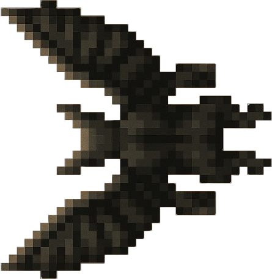
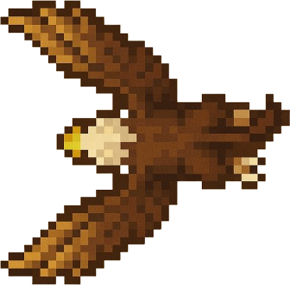
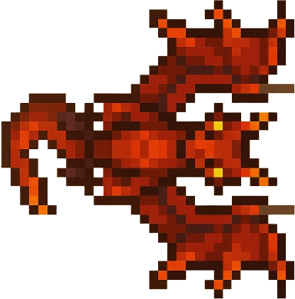
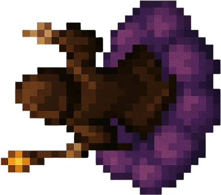
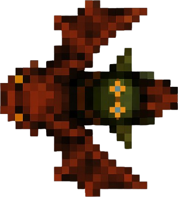

# 💀 Unités ennemies

Bienvenue dans le guide des unités ennemies de **Galad Islands**. Retrouvez ici toutes les informations sur les unités du camp adverse, leurs capacités et conseils tactiques.

---

## Vue d'ensemble

Le camp adverse dispose aussi de **5 unités principales**, chacune avec ses propres atouts et menaces :

| Unité        | Type         | Rôle                  | Vie  | Attaque | Spécialité                |
|--------------|--------------|-----------------------|------|---------|---------------------------|
| **Éclaireur Ennemi** | Intercepteur | Harcèlement     | 90   | 30      | Vitesse, esquive          |
| **Guerrier Ennemi**  | Blindé       | Percée/Front    | 400  | 120     | Armure lourde, zone       |
| **Brute Ennemie**    | Furtif       | Sabotage        | 110  | 40      | Invisibilité, sabotage    |
| **Chaman Ennemi**    | Soutien      | Affaiblissement | 130  | 0       | Malédiction, drain de vie |
| **Ingénieur Ennemi** | Défenseur    | Plateforme      | 350  | 60      | Bouclier, défense         |

---

### ⚡ Éclaireur Ennemi

#### Caractéristiques de l'Éclaireur Ennemi

- **Type** : Unité de harcèlement rapide
- **Vitesse** : ⭐⭐⭐⭐⭐ (Très rapide)
- **Résistance** : ⭐ (Très fragile)
- **Attaque** : ⭐⭐ (Rapide, faible)
- **Spécialité** : Esquive accrue

#### Capacité spéciale de l'Éclaireur Ennemi : Rafale d’esquive (`R`)

- **Effet** : Devient temporairement intouchable pendant 2 secondes
- **Cooldown** : 12 secondes

#### Utilisation tactique de l'Éclaireur Ennemi

!!! warning "Menace : Éclaireur Ennemi"
    Les éclaireurs ennemis sont utilisés pour harceler vos éclaireurs, couper les renforts et détourner l’attention. Ils sont dangereux en groupe mais tombent vite sous le feu concentré.

---

### 🛡️ Guerrier Ennemi

#### Caractéristiques du Guerrier Ennemi

- **Type** : Unité de percée blindée
- **Vitesse** : ⭐ (Très lent)
- **Résistance** : ⭐⭐⭐⭐⭐ (Très blindé)
- **Attaque** : ⭐⭐⭐⭐ (Zone)
- **Spécialité** : Dégâts de zone

#### Capacité spéciale du Guerrier Ennemi : Choc de masse (`R`)

- **Effet** : Inflige des dégâts de zone et repousse les unités proches
- **Cooldown** : 25 secondes

#### Utilisation tactique du Guerrier Ennemi

!!! danger "Menace : Guerrier Ennemi"
    Les guerriers ennemis sont utilisés pour briser vos lignes et absorber les dégâts. Évitez de les affronter sans soutien ou sans unités à dégâts élevés.

---

### 👻 Brute Ennemie — (shop id: `enemy_brute`)

#### Caractéristiques de la Brute Ennemie

- **Type** : Unité furtive
- **Vitesse** : ⭐⭐⭐⭐ (Rapide)
- **Résistance** : ⭐⭐ (Fragile)
- **Attaque** : ⭐⭐ (Sabotage)
- **Spécialité** : Invisibilité

#### Capacité spéciale de la Brute Ennemie : Camouflage (`R`)

- **Effet** : Devient invisible pendant 8 secondes
- **Cooldown** : 18 secondes

#### Utilisation tactique de la Brute Ennemie

!!! warning "Menace : Brute Ennemie"
    Les brutes ennemies brisent les lignes et perturbent les formations ; attention à leur présence dans les combats rapprochés.

---

### ☠️ Chaman Ennemi

#### Caractéristiques du Chaman Ennemi

- **Type** : Soutien/mage
- **Vitesse** : ⭐⭐ (Lent)
- **Résistance** : ⭐⭐ (Moyenne)
- **Attaque** : - (Aucune directe)
- **Spécialité** : Affaiblissement, drain

#### Capacité spéciale du Chaman Ennemi : Malédiction (`R`)

- **Effet** : Réduit l’attaque et la défense des unités proches
- **Cooldown** : 20 secondes

#### Utilisation tactique du Chaman Ennemi

!!! tip "Menace : Chaman Ennemi"
    Les chamans ennemis affaiblissent vos troupes et soignent les autres ennemis. Ciblez-les en priorité lors des affrontements.

---

### 🏰 Ingénieur Ennemi

#### Caractéristiques de l'Ingénieur Ennemi

- **Type** : Défenseur mobile
- **Vitesse** : ⭐ (Très lent)
- **Résistance** : ⭐⭐⭐⭐ (Blindé)
- **Attaque** : ⭐⭐⭐ (Défense)
- **Spécialité** : Bouclier protecteur

#### Capacité spéciale de l'Ingénieur Ennemi : Bouclier énergétique (`R`)

- **Effet** : Génère un bouclier qui réduit de 50% les dégâts subis pendant 10 secondes
- **Cooldown** : 30 secondes

#### Utilisation tactique de l'Ingénieur Ennemi

!!! warning "Menace : Ingénieur Ennemi"
    Les ingénieurs ennemis construisent et protègent des positions défensives ; détruisez leurs installations pour percer les défenses ennemies.

---

*Pour plus de conseils sur la gestion des menaces ennemies, consulte la section Stratégie !*
